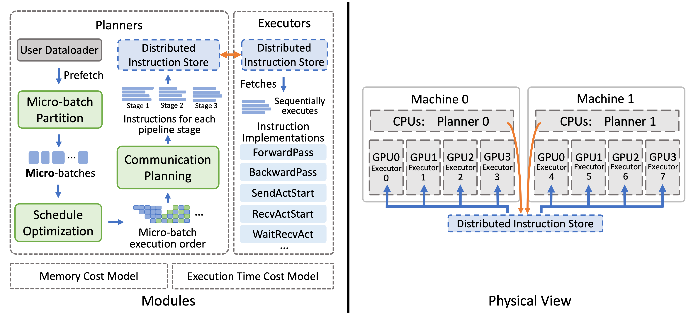

<!--- Copyright Amazon.com, Inc. or its affiliates. All Rights Reserved. -->
<!--- SPDX-License-Identifier: Apache-2.0  -->

## Optimizing Multi-task Training through Dynamic Pipelines

Official repository for the paper *DynaPipe: Optimizing Multi-task Training through Dynamic Pipelines* ([Paper](https://arxiv.org/abs/2311.10418)).

During multi-task training, the model commonly receives input sequences of highly different lengths due to the diverse contexts of different tasks. Padding (to the same sequence length) or packing (short examples into long sequences of the same length) is usually adopted to prepare input samples for model training, which is nonetheless not space or computation efficient. This project adopts a dynamic micro-batching approach to tackle sequence length variation. Each input global batch is split into multiple variable-length micro-batches, each of which comprises a (potentially different) number of samples of similar sequence lengths. These micro-batches are efficiently organized into pipelines, facilitating efficient 3D-parallel (data, tensor and pipeline) multi-task model training.

Main features of this project include:

* An efficient dynamic programming algorithm to compute the optimal micro-batching plan for each input global batch.
* A pipeline schedule robust to variable-sized micro-batches, minimizing pipeline bubbles.
* A pipeline executor supporting highly dynamic pipelines (the pipeline schedule, the size and number of micro-batches can vary each iteration), based on an instruction-based abstraction of pipeline operations.
* Overlapped execution plan generation with model training.


## System Diagram


## Getting Started

### Dependencies
#### Redis
The distributed instruction store uses Redis as the underlying key-value store. [Redis server](https://redis.io/) needs to be installed on machines participating in training. Our code will setup and initialize a Redis server automatically.

*Note*: The Redis server is not protected by authentication and may pose security risks. Please make sure that the code is only run in a secure environment.

#### Python Dependencies
Please see [requirements.txt](requirements.txt) for the required Python packages. Install them by running

```pip3 install -r requirements.txt```

### Installation
Clone this repository and run

```pip3 install -e .```

Then, build the C++ extensions by running

```
cd dynapipe/data_opt
make
cd ../memory_opt
python3 setup.py build
```


### Pipeline Instructions
To use this project, the Pipeline Instructions (defined [here](/dynapipe/pipe/instructions.py)) needs to be implemented using the intented training framework (e.g., Megatron-LM). A reference implementation of the instructions in Megatron-LM can be found [here](https://github.com/chenyu-jiang/Megatron-LM/blob/dynapipe/megatron/pipeline_executor.py).

### Using this project

*Please note that this project is experimental and only tested on [integrating with Megatron-LM](https://github.com/chenyu-jiang/Megatron-LM) (please refer to the linked repository for detailed usage).*

This project interacts with the training framework mainly through the following two interfaces:

#### Data Loader

We wrap the micro-batch splitting and execution plan generation process into a `DynaPipeDataLoader`. It takes the normal PyTorch data loader arguments with a few additional ones. Please see [here](/dynapipe/pipe/data_loader.py) for the full list of arguments. The returning iterator will generate tuples of micro-batched data and the corresponding execution plan for each iteraton. This iterator is to be used by the pipeline executor. See [here](https://github.com/chenyu-jiang/Megatron-LM/blob/dynapipe/megatron/data/data_samplers.py) for an example of using the `DynaPipeDataLoader` in Megatron-LM.

#### Pipeline Executor

The pipeline executor simply reads in execution plans and calls the Pipeline Instruction Implementations. These implementations are registered to the executor through the [`register_handler` function](https://github.com/chenyu-jiang/Megatron-LM/blob/3def65d56515b0b3e617b47abb86088d79b15c9c/megatron/pipeline_executor.py#L393C17-L393C17). To run the pipeline executor, simply call the `execute` function with the corresponding execution plan in each iteration. See [here](https://github.com/chenyu-jiang/Megatron-LM/blob/3def65d56515b0b3e617b47abb86088d79b15c9c/megatron/training.py#L705C9-L705C9) for an example of using the pipeline executor in Megatron-LM.

#### Environment Variables

Except for the above two interfaces, this project can also be configured through the following environment variables:

* `DYNAPIPE_KV_HOST`: The host IP of the Redis kv store server. Default to 'localhost' (requried for multi-node training).
* `DYNAPIPE_KV_PORT`: The port for the Redis kv store server. Default to 29500.
* `DYNAPIPE_DEBUG`: Logging level. Default to 'INFO'. Set to 'DEBUG' for more detailed logging.
* `DYNAPIPE_LOGGING_DEBUG_DIR`: The directory to store all generated logs.
* `DYNAPIPE_DEBUG_DUMP_EP_STATS`: if set true, dump the generated execution plans, seen sequence lengths, shapes of the generated micro-batches, estimated memory and simulated traces for each iteration during training. Used for debugging and for collecting statistics during our experiments.
* `DYNAPIPE_DEBUG_DUMP_EP_PREFIX`: the directory for dumping the above artifacts.

## Code Structure
```
├── dynapipe
│   : main source folder
│   ├── data_opt
│   │   : code for micro-batch splitting and cost models
│   ├── memory_opt
│   │   : contains the modified cuda caching memory allocator 
│   │     from PyTorch
│   ├── pipe
│   │   : contains implementation of pipeline instructions,
│   │     executor, and the distributed instruction store
│   ├── schedule_opt
│   │   : code for computing pipeline schedule
│   └── utils
│       : other util codes like logger
├── scripts
│   : utility scripts for various purposes 
├── tests
│   : unit tests of different modules
```


## Security

See [CONTRIBUTING](CONTRIBUTING.md#security-issue-notifications) for more information.

## License

This project is licensed under the Apache-2.0 License.